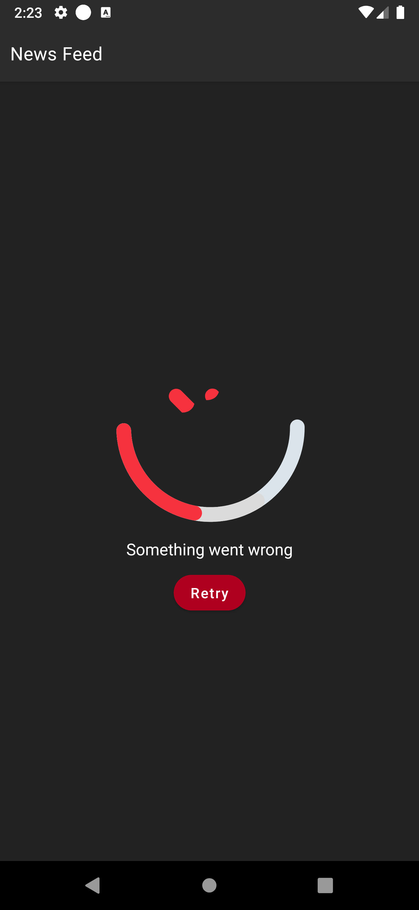

# News Feed

An android application displaying the list of top headlines.

## Tools and Libraries
* Jetpack Compose
* Clean architecture
* MVVM with repository pattern
* Retrofit
* Coroutine
* Room database
* Coil
* Timber

## Screenshots
<ul>
  
  
  
</ul>

## How to run
* Import the project into the latest version of android studio
* Get your API key from [here](https://newsapi.org/)
* Add your API key inside the `local.properties` file as show in the image below

## Author

* [Segun Francis](https://www.linkedin.com/in/segun-francis-302361a1)

## License

      Copyright 2023 Segun Francis

      Licensed under the Apache License, Version 2.0 (the "License");
      you may not use this file except in compliance with the License.
      You may obtain a copy of the License at

        http://www.apache.org/licenses/LICENSE-2.0

      Unless required by applicable law or agreed to in writing, software
      distributed under the License is distributed on an "AS IS" BASIS,
      WITHOUT WARRANTIES OR CONDITIONS OF ANY KIND, either express or implied.
      See the License for the specific language governing permissions and
      limitations under the License.