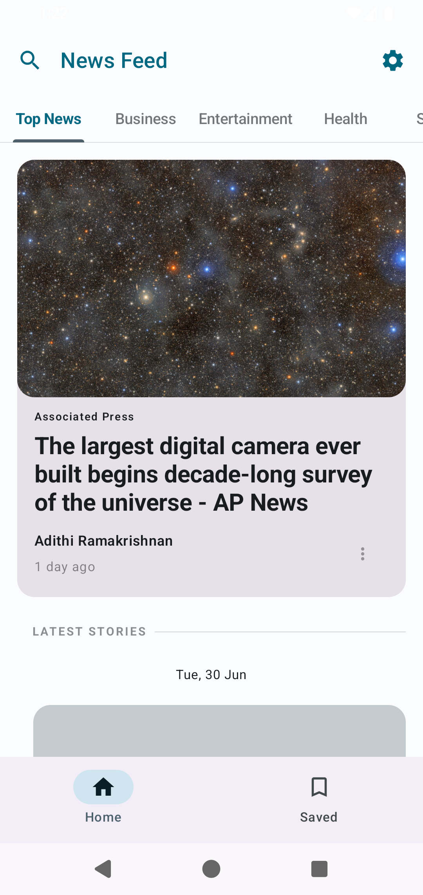
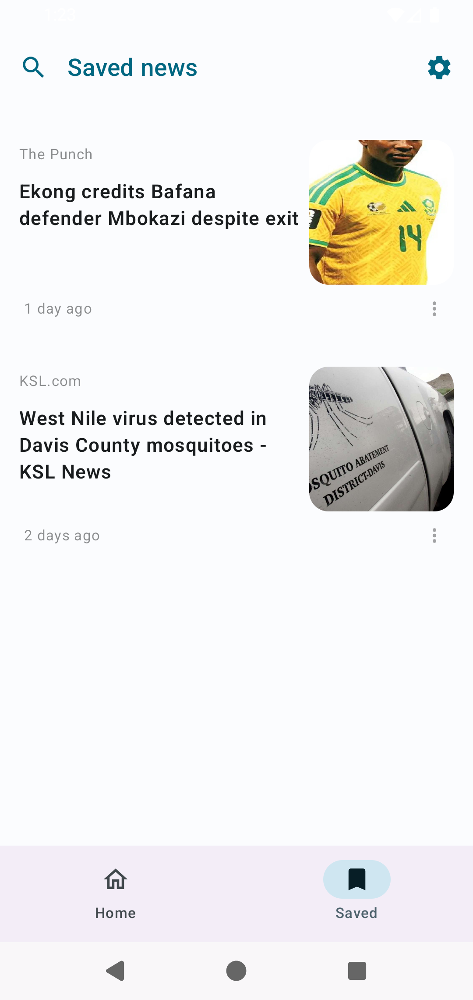
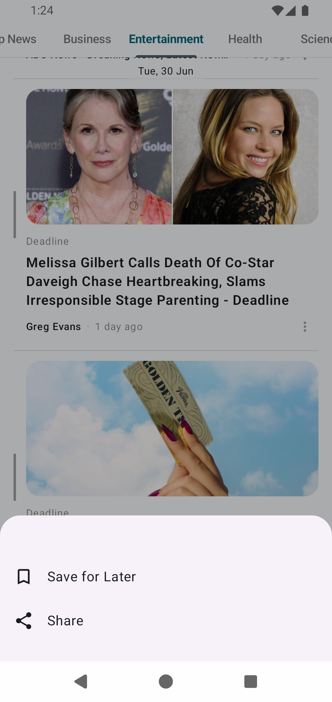

# News Feed

An android application displaying the list of top news from different news categories.

## Tools and Libraries
* [Jetpack Compose](https://developer.android.com/jetpack/compose) - Modern toolkit for building native UI.
* [Clean Architecture](https://blog.cleancoder.com/uncle-bob/2012/08/13/the-clean-architecture.html) - To ensure separation of concerns and testability.
* [MVVM with Repository Pattern](https://developer.android.com/topic/architecture) - For managing UI-related data and logic.
* [Retrofit](https://square.github.io/retrofit/) - Type-safe HTTP client for Android and Java.
* [Coroutines](https://kotlinlang.org/docs/coroutines-overview.html) & [Flow](https://kotlinlang.org/docs/flow.html) - For asynchronous programming.
* [Room Database](https://developer.android.com/training/data-storage/room) - A persistence library for local data caching.
* [Hilt](https://developer.android.com/training/dependency-injection/hilt-android) - A dependency injection library for Android.
* [Coil](https://coil-kt.github.io/coil/) - Image loading library for Android backed by Kotlin Coroutines.
* [Timber](https://github.com/JakeWharton/timber) - A logger with a small, extensible API.
* [Paging 3](https://developer.android.com/topic/libraries/architecture/paging/v3-paged-data) - For loading and displaying pages of data.

## Project Structure
The project follows **Clean Architecture** principles, divided into the following layers:

### 1. Data Layer (`com.segunfrancis.newsfeed.data`)
Contains the implementation of the repository and data sources (local and remote).
* `local/`: Room database, entities, and DAOs.
* `remote/`: Retrofit API services and network models.
* `NewsRemoteMediator.kt`: Implementation of the Paging 3 RemoteMediator for offline support.

### 2. Domain Layer (`com.segunfrancis.newsfeed.domain`)
The core layer containing business logic, domain models, and repository interfaces. This layer is independent of any other layer.
* `NewsFeedRepository.kt`: Interface for the news repository.
* `DomainModel.kt`: Business logic models.

### 3. UI Layer (`com.segunfrancis.newsfeed.ui`)
Contains the Jetpack Compose UI components and ViewModels.
* `home/`: UI for the home news list.
* `favourite/`: UI for bookmarked articles.
* `settings/`: App settings.
* `MainViewModel.kt`: Orchestrates data flow between UI and Domain layers.

## Screenshots
<ul>
  
  
  
  
</ul>

## How to run
* Import the project into the latest version of Android Studio
* Get your API key from [here](https://newsapi.org/)
* Add your API key inside the `local.properties` file as show in the image below

## Author

* [Segun Francis](https://www.linkedin.com/in/segun-francis-302361a1)

## License

      Copyright 2023 Segun Francis

      Licensed under the Apache License, Version 2.0 (the "License");
      you may not use this file except in compliance with the License.
      You may obtain a copy of the License at

        http://www.apache.org/licenses/LICENSE-2.0

      Unless required by applicable law or agreed to in writing, software
      distributed under the License is distributed on an "AS IS" BASIS,
      WITHOUT WARRANTIES OR CONDITIONS OF ANY KIND, either express or implied.
      See the License for the specific language governing permissions and
      limitations under the License.